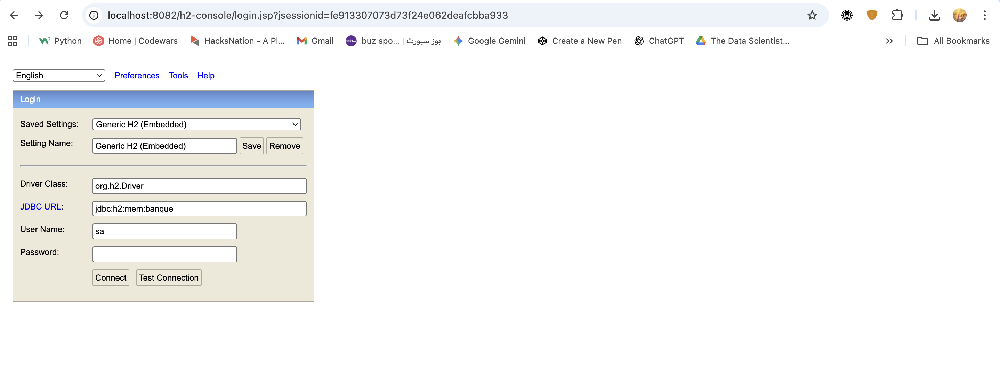
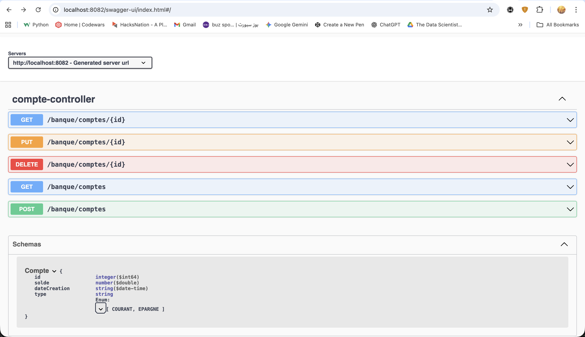

# Spring Boot REST API with Spring MVC

This is a simple RESTful web service built with Spring Boot and Spring MVC. It provides basic CRUD operations for a `Compte` (Account) entity.

## Technologies Used

- Java 17
- Spring Boot
- Spring MVC
- Spring Data JPA
- H2 in-memory database
- Swagger (SpringDoc)
- Jackson (for JSON and XML)
- Lombok
- Maven

## How to Run

1. Clone the repository.
2. Open a terminal in the project root directory.
3. Run the application using Maven:
   ```bash
   mvn spring-boot:run
   ```
4. The application will be available at `http://localhost:8082`.

## H2 Database Console

You can access the H2 database console to view the data at the following URL:

`http://localhost:8082/h2-console`

Make sure to use the following JDBC URL to connect:
`jdbc:h2:mem:banque`



## Swagger UI API Documentation

Interactive API documentation is available via Swagger UI once the application is running.

`http://localhost:8082/swagger-ui.html`



## REST API Endpoints

The API provides the following endpoints to manage bank accounts:

- **GET /banque/comptes**: Retrieve all accounts.
- **GET /banque/comptes/{id}**: Retrieve a specific account by its ID.
- **POST /banque/comptes**: Create a new account.
- **PUT /banque/comptes/{id}**: Update an existing account.
- **DELETE /banque/comptes/{id}**: Delete an account.

The API supports both JSON and XML formats for requests and responses.

### API Testing Examples

Here are some examples of testing the API.

**GET /banque/comptes (JSON)**

*Response:*


**GET /banque/comptes (XML)**


**POST /banque/comptes (JSON)**


**POST /banque/comptes (XML)**


**PUT /banque/comptes/{id} (JSON)**


**PUT /banque/comptes/{id} (XML)**


**DELETE /banque/comptes/{id}**
